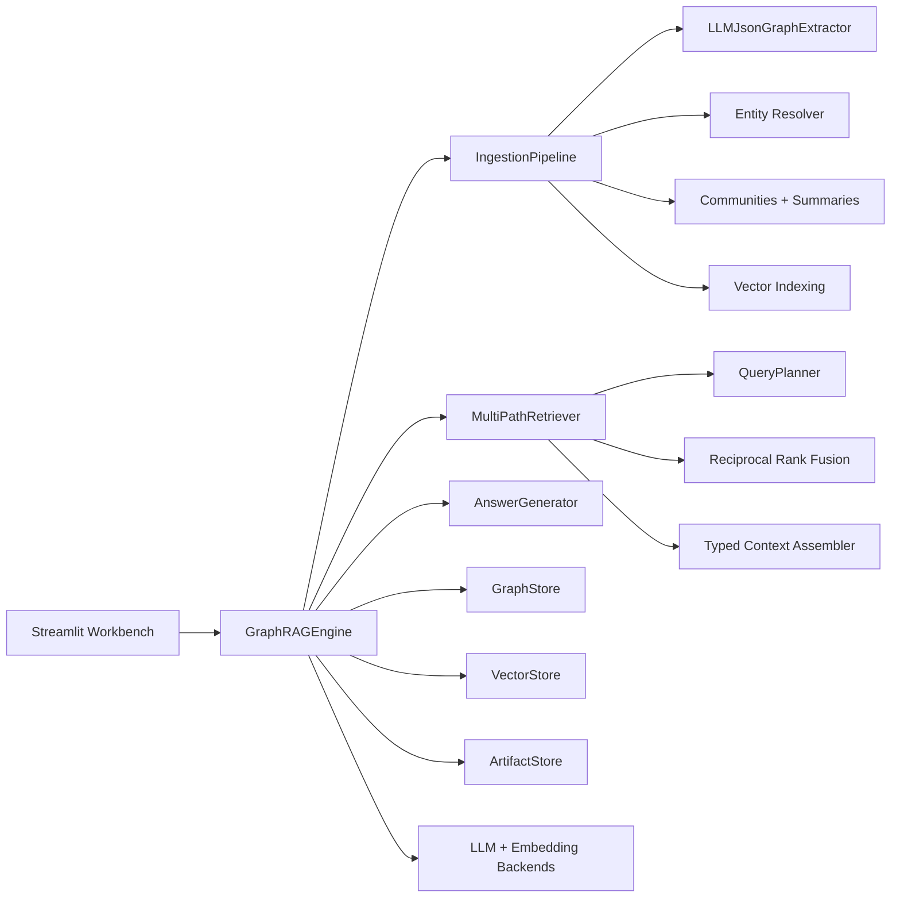

# GraphForge RAG

GraphForge RAG is a local-first, production-oriented Graph Retrieval-Augmented
Generation system. It turns documents into a typed entity-relation knowledge
graph, indexes graph and text surfaces with embeddings, and answers questions
through hybrid retrieval over chunks, entities, relationships, community
summaries, graph walks, and symbolic graph lookups.


## Highlights

- **Streamlit GraphRAG Workbench** with corpus ingestion, querying, graph
  visualization, evidence inspection, settings, and full operational logs.
- **Local open-source model support** through HuggingFace Transformers and
  SentenceTransformers.
- **Hosted OpenAI-compatible model support** for vLLM, SGLang, TGI gateways,
  TEI, LM Studio, llama.cpp servers, and similar endpoints.
- **LLM JSON graph extraction** with schema-constrained prompts and rule-based
  fallback for malformed extraction responses.
- **Multi-format document ingestion** for `.txt`, `.md`, and text-layer `.pdf`
  files.
- **Hybrid graph retrieval** combining vector recall, keyword recall,
  relationship recall, Personalized PageRank, community summaries, and symbolic
  reads.
- **Observability-first UI** with per-call model traces, hosted HTTP call logs,
  ingestion results, timings, errors, and JSON/JSONL log export.
- **Testable core package** with deterministic local model stubs for fast unit
  tests and repeatable CI.

## Architecture At A Glance



The diagram above shows the core runtime path. The implementation keeps each
stage behind explicit interfaces so the in-memory stores can be replaced with
Neo4j, FalkorDB, Kuzu, Qdrant, Milvus, LanceDB, S3, or another production
backend without rewriting the ingestion and query orchestration layers.

## Quick Start

### 1. Create an environment

```bash
python -m venv .venv
.venv\Scripts\activate
python -m pip install -U pip
```

On macOS or Linux:

```bash
python -m venv .venv
source .venv/bin/activate
python -m pip install -U pip
```

### 2. Install the app

For the Streamlit UI and PDF ingestion:

```bash
python -m pip install -e ".[ui]"
```

For local HuggingFace inference:

```bash
python -m pip install -e ".[ui,hf]"
```

### 3. Run the workbench

```bash
streamlit run streamlit_app.py
```

Open:

```text
http://127.0.0.1:8501
```

### 4. Run tests

```bash
python -m unittest discover -s tests
```

## Streamlit Workbench

The UI is organized around the main GraphRAG workflow:

| Tab | Purpose |
| --- | --- |
| `Corpus` | Ingest text, Markdown, PDFs, or synthetic sample data. |
| `Ask` | Run retrieval-only or answer-generation queries. |
| `Graph` | Inspect extracted entities, relationships, communities, and graph visualization. |
| `Evidence` | Drill into retrieved evidence and assembled context. |
| `Logs` | Inspect every app event, model call, hosted API call, result, error, and timing. |
| `Settings` | Export runtime state and inspect model/configuration details. |

The sidebar controls model runtime, retrieval parameters, graph construction,
chunking, symbolic reads, community summaries, and model backend validation.

## Model Backends

The workbench supports three runtime modes.

| Runtime | Use case | Notes |
| --- | --- | --- |
| `Local deterministic` | Fast tests, no model dependencies | Uses `HashingEmbeddingModel` and `HeuristicLLM`; not intended for answer quality. |
| `HuggingFace Hub local` | Local open-source models loaded in-process | Uses Transformers and SentenceTransformers. Best for local development. |
| `Hosted HuggingFace-compatible` | Separate model servers | Uses OpenAI-compatible `/chat/completions` and `/embeddings` endpoints. |

Current reliable local defaults in the app:

```text
Generation repo id: Qwen/Qwen2.5-1.5B-Instruct
Embedding repo id: sentence-transformers/all-MiniLM-L6-v2
Embedding dimension: 384
LLM device map: blank
Local files only: enabled when the model pair is cached
```

Available local presets:

```text
Cached Qwen 1.5B + MiniLM
Fast Qwen 0.5B + MiniLM
Quality Qwen3-8B + BGE-M3
Your EmpPolRAG repo + MiniLM
```

`BAAI/bge-m3` is a stronger 1024-dimensional embedding model, but it must be
fully downloaded or available in the HuggingFace cache before local loading can
work. Text-only PDF ingestion uses `pypdf`; scanned PDFs need OCR first.

## Graph Construction

During ingestion, the app builds a graph as follows:

1. Parse uploaded text, Markdown, or text-layer PDF content.
2. Split each document into overlapping chunks.
3. Extract entities and relationships with `LLMJsonGraphExtractor`.
4. Fall back to `RuleBasedExtractor` if enabled and the LLM emits malformed or
   empty JSON.
5. Resolve duplicate entities by normalized type/name.
6. Filter relationships by confidence.
7. Build connected-component communities.
8. Summarize communities with the active LLM when community summaries are
   enabled.
9. Embed chunks, entities, relationships, and community summaries into separate
   vector namespaces.

LLM extraction can be slower than rule-based extraction because each chunk needs
at least one local model generation call. For fast ingestion, use `Rule-based`,
disable `Community summaries`, or select the fast Qwen preset.

## Retrieval And Answering

Queries use a multi-path retrieval stack:

- deterministic query planning
- dense chunk search
- keyword chunk search
- dense entity search
- dense relationship search
- graph walk via Personalized PageRank
- community-summary search for global/exploratory questions
- symbolic read boundary for simple graph lookups
- reciprocal-rank fusion
- typed context assembly
- grounded answer generation with citations and graph evidence

This gives the system both RAG-style source passage recall and graph-native
multi-hop evidence.

## Document Uploads

Supported uploads:

```text
.txt
.md
.pdf
```

PDF ingestion extracts text page-by-page with `pypdf` and stores metadata such
as page count, pages with extracted text, and empty pages. Image-only or scanned
PDFs do not contain extractable text; run OCR first and upload the OCR text or a
searchable PDF.

## Observability

The `Logs` tab records structured events for:

- rebuilds and runtime changes
- ingestion results
- file decoding and PDF extraction
- LLM calls
- embedding calls
- hosted HTTP API calls
- retrieval and answer pipeline results
- errors and exception details

Logs can be filtered by category/status, inspected as JSON, and downloaded as
JSON or JSONL.

## Project Layout

```text
advanced_graphrag/
  config.py                  Runtime config and retrieval weights
  domain.py                  Typed documents, chunks, entities, relationships, evidence
  engine.py                  GraphRAGEngine facade
  ingestion/
    chunking.py              Structural chunking
    extraction.py            LLM JSON and rule-based graph extractors
    resolution.py            Entity resolution
    communities.py           Connected components and community summaries
    pipeline.py              End-to-end ingestion
  retrieval/
    query_planner.py         Intent and symbolic query planning
    retriever.py             Hybrid multi-path retrieval
    graph_walk.py            Personalized PageRank
    fusion.py                Reciprocal-rank fusion
    context.py               Typed context assembly
  models/
    local.py                 Deterministic test models
    huggingface.py           Local HF model adapters
    openai_compatible.py     OpenAI-compatible hosted adapters
  stores/
    memory.py                In-memory graph/vector/artifact stores
    base.py                  Store interfaces

streamlit_app.py             Interactive GraphRAG workbench
tests/                       Unit and smoke tests
examples/                    Minimal example scripts
```

## Extension Points

| Interface | Current implementation | Production replacement |
| --- | --- | --- |
| `GraphStore` | `InMemoryGraphStore` | Neo4j, FalkorDB, Kuzu, ArangoDB, Neptune |
| `VectorStore` | `InMemoryVectorStore` | Qdrant, Milvus, LanceDB, FAISS, pgvector |
| `ArtifactStore` | Memory or filesystem | S3, GCS, Azure Blob, database-backed manifests |
| `LLMClient` | Heuristic, Transformers, OpenAI-compatible | vLLM, TGI, SGLang, LM Studio, llama.cpp |
| `EmbeddingModel` | Hashing, SentenceTransformers, OpenAI-compatible | BGE, E5, GTE, Jina, TEI, vLLM embeddings |
| `GraphExtractor` | LLM JSON, rule-based | Schema-constrained domain extractor, ontology-aware extractor |

## Research Lineage

The implementation intentionally combines ideas from inspected GraphRAG systems:

- Microsoft GraphRAG: entity graphs, communities, global sensemaking.
- LightRAG: local/global/hybrid retrieval modes.
- HippoRAG and FastGraphRAG: entity/fact embeddings and graph walk retrieval.
- FalkorDB and AWS GraphRAG patterns: multi-path retrieval, operational
  ingestion, and clear storage boundaries.
- Neo4j GraphRAG: symbolic query boundary and graph-native retrieval.
- KAG: planning, schema-aware extraction, and graph reasoning hooks.
- NodeRAG and G-Retriever: heterogeneous evidence surfaces and compact graph
  evidence.


## Known Tradeoffs

- The default stores are in-memory and reset on rebuild/clear.
- LLM graph extraction is more accurate than rule-based extraction but slower.
- Community summaries add LLM calls during ingestion.
- The default query planner is deterministic; it is designed to be replaced by
  an LLM planner if needed.
- PDF parsing extracts text layers only; OCR is out of scope for the current
  parser.
- The current community detector uses connected components; production systems
  may want Leiden or Louvain clustering.

## Development

Run all tests:

```bash
python -m unittest discover -s tests
```

Run the deterministic quickstart:

```bash
python examples/local_quickstart.py
```

Run the UI:

```bash
streamlit run streamlit_app.py
```

## License

This project is configured as MIT in `pyproject.toml`.
